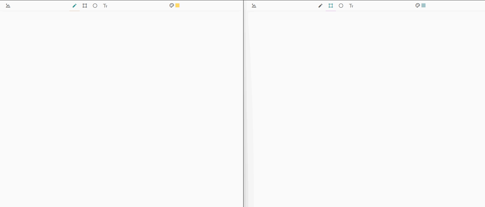

# Realtime Collaborative Drawing 

## How to use ...
  - If you want to increase the size of brush you just need to press `ArrowUp` or `ArrowDown` accordingly key while using the brush.
  - If you want to change the color you can also change it by color option in menu or you can use `ArrowRight` or `ArrowLeft` key.

## Fun with your friends
## Developed by tanuj upadhyay
